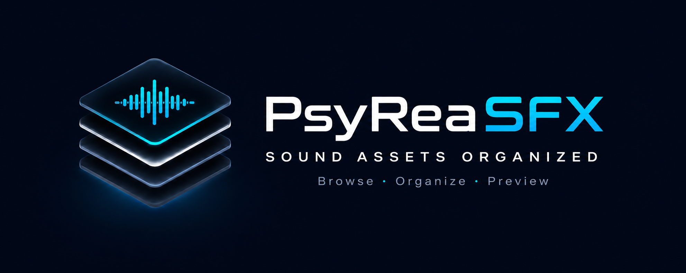
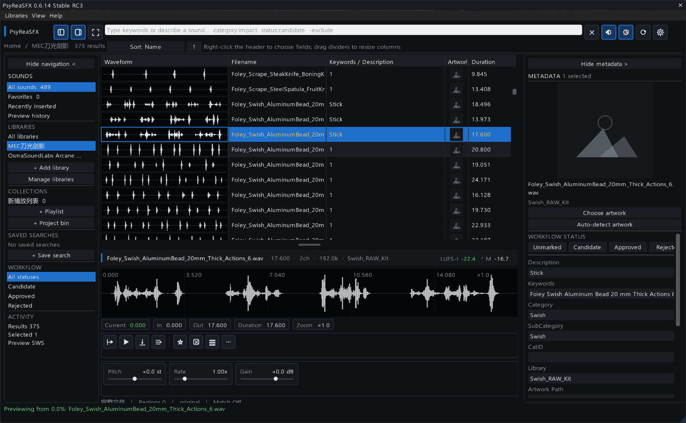
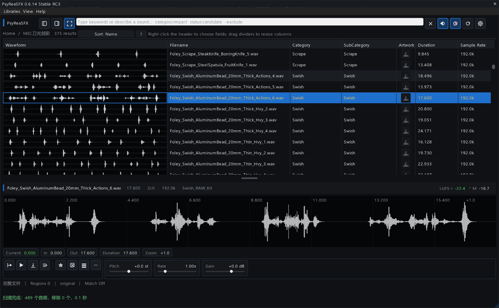
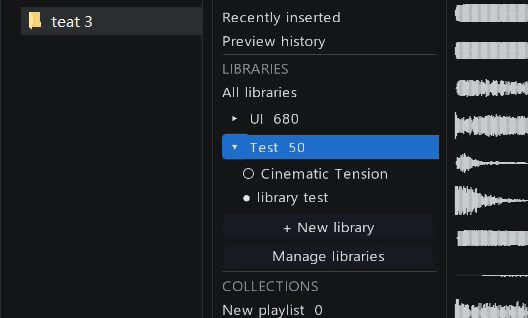
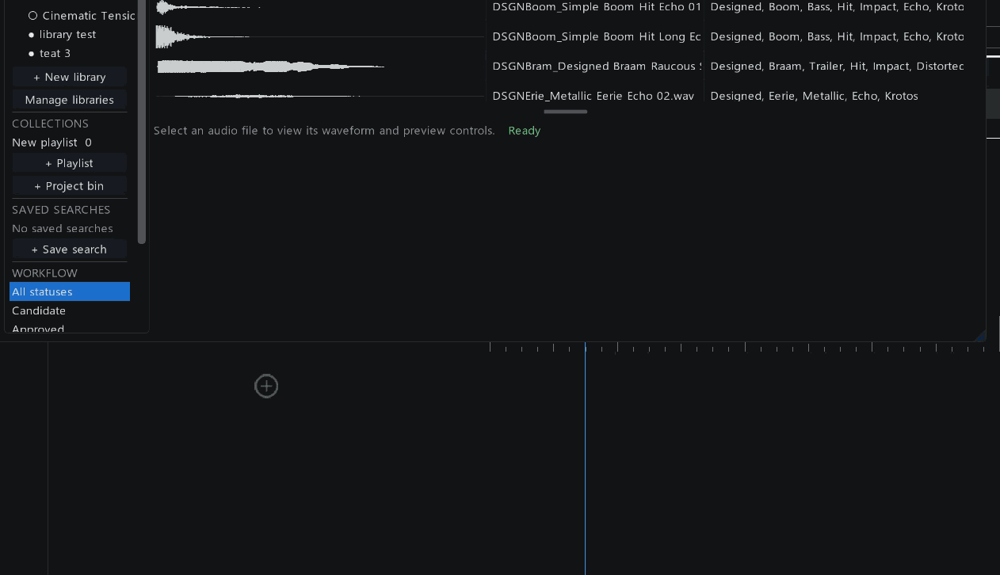
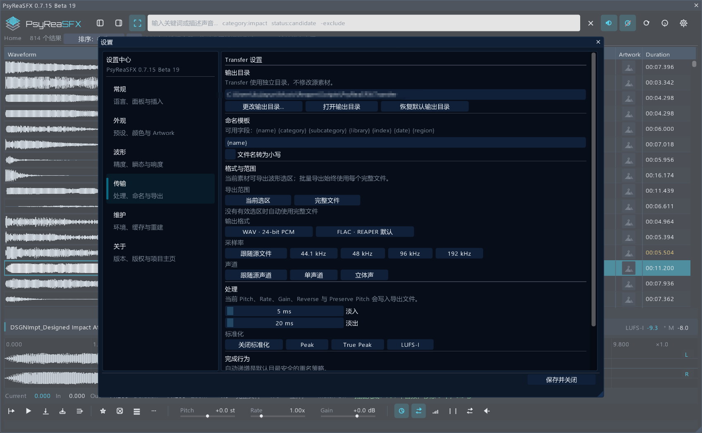

<p align="center">
  
</p>

<p align="center">
  <strong>浏览 · 整理 · 试听 · 交付</strong><br>
  运行在 REAPER 内部的高性能音效资产工作区。
</p>

<p align="center">
  
  
  
  
</p>

> [English](README.md) · **简体中文**

## 一个界面，完成音效库工作的完整循环

PsyReaSFX 把素材库管理、波形浏览、搜索、试听、整理、REAPER 放置与处理后导出集中在一个可停靠界面中。它不会取代你的 REAPER 工程，而是在工程旁边提供一个专注的音效资产工作区。

它面向需要长期维护大型个人或制作素材库的游戏音频设计师、声音设计师和 REAPER 用户。磁盘路径、元数据、试听记录与工程候选能够保持清晰，同时尽量减少扫描、缓存和界面对工作的打断。

## 工作流程

| 发现 | 整理 |
|---|---|
| 直接浏览列表波形，联合搜索文件名和元数据，按库或工作流状态筛选，并从波形任意位置开始试听。 | 把多个硬盘路径聚合为一个逻辑库，维护独立 Artwork 与元数据，并把素材放进播放列表或项目素材箱。 |

| 试听 | 交付 |
|---|---|
| 查看高精度声道波形，建立选区、循环或擦播，调整 Pitch、Rate、Gain，比较响度并保存有用 Region。 | 把文件或选区插入 REAPER、按 BWF 位置放置、从浏览器拖入工程，或通过 Transfer 生成处理后的新文件。 |

## 工作区

<p align="center">
  
</p>

工作区由四个可配合使用、也可独立隐藏的模块组成：

- **导航**：逻辑音效库、实体来源、收藏、集合、保存搜索和工作流筛选。
- **结果列表**：固定表头、可配置字段、内联波形、元数据、Artwork 与时长。
- **元数据检查器**：固定 Artwork，以及非破坏性的元数据查看与编辑。
- **预览与交付**：分声道大波形、时间选区、响度、Region、试听控制和 REAPER 操作。

左右面板可以分别收起；专注模式只保留结果列表和预览区域。

<p align="center">
  
</p>

## 实机工作流

### 用多个实体来源组成一个逻辑音效库

先建立逻辑库，再在主界面原位展开，并逐步挂载互相独立的实体文件夹。
每个来源保留自己的路径、在线状态与 Artwork 归属。

<p align="center">
  
</p>

### 波形选区与 REAPER 交付

在大波形上拖出精确区间，试听选区后，直接把该区间拖入 REAPER
编排区。

<p align="center">
  
</p>

## 核心能力

### 符合真实存储方式的素材库

逻辑音效库不绑定单个文件夹。先建立一个库，再挂载来自不同硬盘或位置的多个实体来源。每个来源保留自己的路径、在线状态和 Artwork。还可以把 Windows 资源管理器中的文件夹拖到某个逻辑库、全部音效库或中央投放区，按目标建立正确关系。

### 贴近素材的搜索方式

普通文字会联合搜索文件名、路径、描述、关键词、分类、库名和 UCS 派生字段。`category:impact`、`library:boom`、`status:candidate`、`marked:true` 等字段筛选及排除词可进一步缩小范围，而不会改变底层素材库。

### 以波形为中心的试听

每条可见结果都可以显示磁盘缓存波形。点击缩略波形任意位置即可从对应时间开始试听。详细预览支持单声道、立体声和多声道分轨显示，以及缩放、平移、擦播、选区、循环、Region 和把选区直接拖入 REAPER 编排区。

### 不破坏源文件的整理

收藏、标记、工作流状态、播放列表、项目素材箱、保存搜索与元数据修改默认保存在 PsyReaSFX 数据库，不直接改写源音频。只有主动执行 Transfer 时，才会在目标位置写出新的文件。

### Transfer 与 REAPER 交付

Transfer 可以导出完整文件或当前波形选区，并配置输出目录、命名模板、WAV 16/24/32-bit PCM 或 FLAC、采样率、声道模式、淡化、Peak / True Peak / RMS-I / LUFS-I 标准化和重名策略。在 REAPER 与目标容器支持时可尽可能保留源元数据；WAV 16-bit 还可启用抖动与噪声整形。

批量变体可以把 Pitch、Rate、Gain 数值列表与正向/反向组合成有界任务。变体命名字段会保持输出唯一；逐文件进度、“当前文件后停止”、TSV 任务报告和临时文件安全替换，让大型批处理可以检查和恢复。处理结果还可以自动插回当前 REAPER 工程。

任务正常完成后可选择自动打开输出目录。设置目录、最近输出和任务报告
使用同一套支持 Unicode 路径的系统打开流程。

当选区结束位置早于源文件结尾时，可选的**源文件智能尾音**会在后续
源音频中查找最后一个超过阈值的声音，并在可配置的最长范围内追加
安全留白。这样可以保留源文件已有的混响或 Delay 尾音，而不必为每个
文件机械增加固定时长。

<p align="center">
  
</p>

## 快速开始

### 环境要求

- REAPER 7.x
- ReaImGui 0.10 或更高版本
- 强烈建议安装 SWS Extension，以获得精确定位试听、声道监听和拖入编排区等完整能力

### 使用 ReaPack 安装

1. 打开 `扩展 → ReaPack → 导入仓库…`。
2. 粘贴仓库地址：

   ```text
   https://github.com/Psysia/PsyReaSFX/raw/main/index.xml
   ```

3. 同步软件包。
4. 搜索并安装 `PsyReaSFX`。
5. 在 REAPER 动作列表中运行脚本；需要时给它绑定快捷键。

ReaPack 会同时安装主脚本、应用图标和 Orbitron 品牌字体，以后也从同一仓库地址更新。

### 建立第一个音效库

1. 如果左侧导航已隐藏，按 `F9` 打开。
2. 点击**新建音效库**，先为逻辑库命名。
3. 添加一个或多个实体文件夹，或从 Windows 资源管理器把文件夹拖到该库上。
4. 等待导入进度完成。
5. 在结果列表的波形上点击，即可开始试听。

## 性能模型

PsyReaSFX 不会一次把整个素材库塞进界面。扫描、元数据、波形建立和 Artwork 发现都被拆分为小任务；可见行和当前选中素材优先处理。波形写入磁盘缓存，也可以在设置中预缓存整个库，以便大型素材库获得可预期的滚动与预览速度。

封面识别同时支持图片和 WAV 位于同一目录，以及
`1. Audio / 2. Artwork` 这类商业音效库结构。带编号的 Artwork、
Cover、Image、Thumbnail 文件夹会在严格的深度和目录数量预算内检查。
识别结果仍归属于各自实体路径，不会把一个来源的封面套用到同一逻辑库
的其他来源。

存在多张候选图时，PsyReaSFX 只读取轻量图片头部，优先选择接近 1:1 的
封面，再以文件名和分辨率决定同级候选。没有封面时，结果列表的 Artwork
单元格保持空白；右侧大检查器继续保留中性的空状态提示。

左侧导航中的声音、音效库、集合、保存搜索、工作流和活动分组可以分别
折叠，状态会在下次启动时恢复。

## 文档

- [中文用户使用说明书](docs/USER_GUIDE_zh-CN.md)
- [English User Guide](docs/USER_GUIDE_en-US.md)
- [中文更新日志](docs/CHANGELOG_zh-CN.md)
- [English Changelog](docs/CHANGELOG_en-US.md)
- [English project page](README.md)

## 发布状态

`0.7.21 Beta 25` 已完成计划中的 0.7 功能集合，并继续进行 Transfer 与交付工作流的兼容性、回归和实机验证。测试期间，`0.6.21` 仍可作为稳定回退版本。

## 作者与许可

PsyReaSFX 由 **Psysia** 创建。  
Copyright © 2026 Psysia. All rights reserved.

随包附带的 Orbitron 字体采用 SIL Open Font License 1.1；许可文本位于 `assets/fonts/OFL.txt`。

项目主页：[github.com/Psysia/PsyReaSFX](https://github.com/Psysia/PsyReaSFX)
