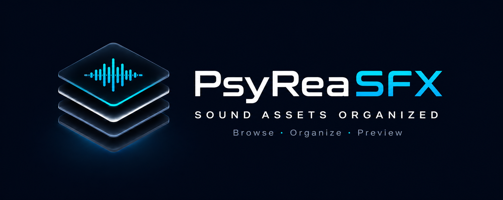

<p align="center">
  
</p>

<h1 align="center">Psysia REAPER 工具集</h1>

<p align="center">
  面向声音设计、剪辑、轨道管理、渲染与素材工作流的一组实用 REAPER 工具。
</p>

<p align="center">
  <strong>简体中文</strong> · <a href="README.md">English</a>
</p>

<p align="center">
  
  
  
</p>

## 关于这个仓库

这个仓库用于集中维护 **Psysia 的 REAPER 工具**。

其中既包括针对单一工作流的小型脚本，也包括体量更大的完整工具。**PsyReaSFX** 是其中规模最大的工具，但并不是整个仓库本身。所有轻量脚本都可以通过同一个 ReaPack 源单独安装。

## 通过 ReaPack 安装

在 REAPER 中打开：

`扩展 → ReaPack → 导入仓库…`

导入以下仓库地址：

```text
https://github.com/Psysia/PsyReaSFX/raw/main/index.xml
```

同步软件包后，直接搜索需要的工具并安装即可。

安装这些小型脚本时，**不需要同时安装 PsyReaSFX**。

## 工具总览

### 素材工作流

| 工具 | 功能 |
|---|---|
| **PsyReaSFX** | 音效资产浏览与工作流工具，用于素材库管理、波形试听、元数据、REAPER 插入与 Transfer。 |

### 渲染

| 工具 | 功能 |
|---|---|
| **创建文件夹区域与渲染矩阵** | 根据选中素材建立 Region，按轨道或文件夹层级命名，并自动写入对应的 Region Render Matrix。 |
| **智能尾音渲染面板** | 配置 REAPER 原生 Render Tail、尾部静音裁切阈值与安全留白，适用于 Region 和时间选区渲染。 |
| **打开渲染对话框并应用自动尾音** | 打开渲染窗口前，自动应用已保存的尾音设置。 |

### 轨道与素材

| 工具 | 功能 |
|---|---|
| **按最早素材位置排序轨道** | 按最早素材位置排序选中轨道；有选中素材时，优先识别素材所在轨道，并按各轨道最早的选中素材排序。 |
| **移除选中素材间隙** | 将选中素材依次首尾相接，快速移除它们之间的空隙。 |
| **拆分选中素材到新轨道** | 将选中素材拆分到新轨道，保持原时间位置，并根据 Take 名称自动命名新轨道。 |
| **原位反转选中素材** | 对选中素材生成反向 Take 并裁切到当前 Take，实现一键原位反转。 |
| **从选中轨道创建文件夹并挂载 Pro-L 2** | 将选中轨道包进新的父文件夹轨，并自动在父轨挂载 Pro-L 2。 |

### 显示与分析

| 工具 | 功能 |
|---|---|
| **切换 LUFS-M 与频谱图** | 在 LUFS-M 频谱峰值显示与普通 Spectrogram 之间快速切换。 |

## PsyReaSFX

<p align="center">
  <strong>浏览 · 整理 · 试听 · 交付</strong><br>
  运行在 REAPER 内部的高性能音效资产工作区。
</p>

PsyReaSFX 面向需要长期维护大型个人或制作素材库的游戏音频设计师、声音设计师和 REAPER 用户。

它把素材库管理、波形浏览、搜索、试听、元数据、集合、REAPER 放置与处理后导出集中在一个可停靠工作区中。

### 主要能力

- 一个逻辑音效库可聚合多个实体来源文件夹。
- 列表内联波形，以及单声道、立体声和多声道详细预览。
- 联合搜索文件名、路径、元数据、UCS 字段、音效库和工作流状态。
- 收藏、播放列表、项目素材箱、工作流状态与非破坏性元数据。
- Region、瞬态建议、LUFS / True Peak、Pitch / Rate / Gain 与声道监听。
- 插入当前轨、新轨、BWF 位置，以及把波形选区直接拖入 REAPER。
- Transfer 支持命名模板、格式转换、采样率与声道设置、淡化、标准化和重名策略。

### PsyReaSFX 下载

- [PsyReaSFX 0.7.23 Stable](https://github.com/Psysia/PsyReaSFX/releases/download/v0.7.23/PsyReaSFX_v0_7_23_Stable.zip)
- [全部 Releases](https://github.com/Psysia/PsyReaSFX/releases)
- [Desktop 项目说明](desktop/README.md)

## 文档

### 小型 REAPER 工具

- [REAPER 工具使用手册 — 简体中文](docs/ReaScripts_Guide_zh-CN.md)
- [REAPER Utility Guide — English](docs/ReaScripts_Guide.md)

### PsyReaSFX

- [用户使用说明书 — 简体中文](docs/USER_GUIDE_zh-CN.md)
- [User Guide — English](docs/USER_GUIDE_en-US.md)
- [更新日志 — 简体中文](docs/CHANGELOG_zh-CN.md)
- [Changelog — English](docs/CHANGELOG_en-US.md)

## 仓库结构

```text
Scripts/Psysia/    REAPER 小型工具脚本
assets/            PsyReaSFX 图片、字体与截图
docs/              使用手册与更新日志
desktop/           PsyReaSFX Desktop 开发文件
website/           项目网站
index.xml          ReaPack 仓库索引
```

## 作者与许可

由 **Psysia** 创建。

Copyright © 2026 Psysia. All rights reserved.

仓库许可详情见 [LICENSE](LICENSE)。第三方随附资源继续遵循各自许可。