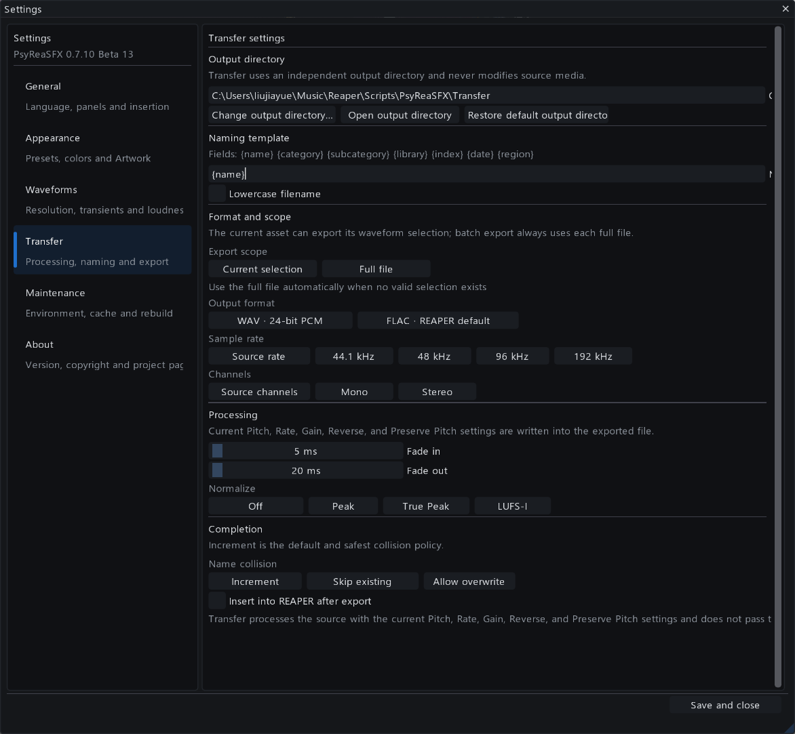

# PsyReaSFX User Guide

**Applies to:** PsyReaSFX 0.7.10 Beta 14  
**Author:** Psysia  
**Host:** REAPER 7.x

This manual explains the product by workflow. Version-by-version implementation details are kept in the separate [Changelog](CHANGELOG_en-US.md).

## 1. Welcome

PsyReaSFX is a sound-asset workspace inside REAPER. It brings library management, inline waveforms, metadata search, audition, organization, timeline placement and processed export into one dockable interface.

The application uses two related storage concepts:

- A **logical library** is the name and group shown in navigation.
- A **source folder** is a physical path on a drive.

One logical library can contain several source folders. This lets a production library span disks or locations without flattening the structure that people use to understand it.

PsyReaSFX is non-destructive by default. Favorites, marks, workflow states, collections, saved searches, regions and metadata edits live in its local database. Source audio is changed only when you explicitly create a new file with Transfer.

## 2. Requirements and installation

### Required

- REAPER 7.x
- ReaImGui 0.10 or newer

### Recommended

- SWS Extension

SWS enables precise seek-from-waveform audition, selection preview, advanced Preview parameters, channel audition and drop placement in the REAPER arrange view. The database, search and basic browsing features still work without it.

### Install with ReaPack

1. In REAPER, open `Extensions → ReaPack → Import repositories...`.
2. Add:

   ```text
   https://github.com/Psysia/PsyReaSFX/raw/main/index.xml
   ```

3. Synchronize packages.
4. Search for `PsyReaSFX` and install it.
5. Open REAPER's Action List, run PsyReaSFX, and assign a shortcut if desired.

ReaPack installs the script, application icon and Orbitron brand font. Updates are delivered through the same repository.

### Manual installation

Keep the release structure intact:

```text
PsyReaSFX_vX_X_X/
├─ PsyReaSFX_vX_X_X.lua
└─ assets/
   ├─ brand/
   └─ fonts/
```

Load the Lua file through the Action List. The interface safely falls back to REAPER's regular UI font if the bundled brand font is missing.

## 3. First launch

1. Press `F9` if the navigation panel is hidden.
2. Select **New library**.
3. Enter a name. This creates the logical library without requiring a path.
4. Add one or more source folders, or drag folders from Windows Explorer onto the new library.
5. Wait for the import task to complete.
6. Click a result waveform to audition from that position.

The first visit to a folder may require waveform and metadata work. Later visits reuse the disk cache.

## 4. Workspace tour

### Top toolbar

The toolbar groups navigation, metadata-inspector and Focus controls beside the brand at the left. This keeps all workspace-layout actions together. The center contains search; preview, scan, Help and Settings actions sit beside it.

Toolbar icons are borderless at rest. Hovering reveals the hit area and accent color; enabled states remain visible. Hover a control briefly to see its localized description.

The small PsyReaSFX mark is drawn as a vector symbol so it remains crisp at compact sizes and high DPI. The product wordmark uses the bundled Orbitron typeface when available.

### Navigation panel

The left panel contains:

- All sounds, Favorites, Recently inserted and Preview history
- logical libraries and their source folders
- playlists and project bins
- saved searches
- workflow-state filters

Use the arrow before a library to expand or collapse its source folders. Clicking a logical library aggregates all of its sources; clicking a source filters to that path.

### Results

The center list combines a pinned header with virtualized rows. The waveform, filename, description, status, categories, duration, format, Artwork, library and path fields can be shown independently.

### Metadata inspector

The right panel displays Artwork, file facts and editable database metadata. Artwork can stay pinned while the metadata below it scrolls.

### Preview workspace

The lower area contains the detailed waveform, selection and playback position, regions, loudness readouts, audition parameters and REAPER delivery actions. Drag the horizontal splitter to balance result and preview space.

### Panel shortcuts

| Shortcut | Action |
|---|---|
| `F9` | Toggle navigation |
| `F10` | Toggle metadata inspector |
| `F11` | Toggle focus mode |

Focus mode hides both side panels without discarding their saved visibility settings.

## 5. Libraries and source folders

### Create an empty logical library

Choose **New library**, enter a name and confirm. No folder is required. Add source folders later as drives or collections become available.

### Add sources

- Right-click a logical library and choose **Add source folder...**.
- Drag one or more Explorer folders onto a logical library.
- Drop a folder on **All libraries** to create a new logical parent.
- Drop on the central target to add to the currently viewed logical library; if there is no suitable context, PsyReaSFX offers to create one.

Duplicate roots and overlapping parent/child roots are blocked to prevent double indexing. If a folder already belongs to another logical library, PsyReaSFX can move the logical ownership. These operations never move or delete disk files.

Offline sources remain listed. Their library relationship can therefore survive removable drives, network volumes and drive-letter changes.

### Artwork ownership

Each physical source folder owns its own automatically detected or manually assigned cover. A cover from one source is never applied to sibling sources merely because they share a logical library.

Right-click an expanded source to choose, rediscover or clear its Artwork. Asset-specific Artwork chosen in the metadata inspector has higher priority than source Artwork.

<p align="center">
  
</p>

The animation above shows one logical library expanded into several independently managed source folders. Clicking the parent searches them as one library; each source remains visible and keeps its own Artwork assignment.

## 6. Search and filter

### Plain text

Plain words search filename, path, description, keywords, Category, SubCategory, CatID, library and UCS-derived fields.

```text
cinematic whoosh
metal impact
magic ui
```

### Field filters

```text
category:impact
subcategory:metal
catid:WPN
library:boom
description:heavy
keywords:magic
channels:2
status:candidate
marked:true
played:true
```

Combine fields and text in the same query. Prefix a word with `-` to exclude it:

```text
whoosh category:movement -long
```

### Saved searches

A saved search can retain the query, library, collection, workflow filter and sort direction. Use it for repeatable review views rather than duplicating assets into extra folders.

## 7. Result columns

Right-click the pinned header to choose visible fields. Drag a divider to resize a column; double-click it to restore the default width.

Duration uses `MM:SS.mmm`, for example `00:04.947`.

When fields are wider than the workspace, hover the header or a row and use `Shift + mouse wheel` to pan horizontally. The header and rows share the same position, and the rightmost field remains reachable without a permanent horizontal scrollbar.

Hidden fields are not drawn, reducing interface work for large result sets.

### Artwork column

Artwork discovery checks the source root and common `Artwork`, `Images`, `Docs` and `Documentation` folders, then performs a bounded parent search. Preferred names include `artwork`, `cover`, `folder`, `front`, `album` and `thumbnail`; PNG, JPG and JPEG are supported.

Discovery is low priority and uses positive and negative folder caching. Hiding the Artwork column stops list-thumbnail requests for it.

## 8. Select and organize results

| Action | Result |
|---|---|
| Click | Select one asset |
| `Ctrl`+click | Add or remove one asset |
| `Shift`+click | Select a continuous range |
| `Ctrl+A` | Select all current results |
| `F` | Toggle favorite |
| `M` | Toggle mark |

Favorites are durable personal choices. Marks are lightweight review flags. Workflow states—Unmarked, Candidate, Approved and Rejected—form a separate editorial field.

Create playlists for reusable groups and project bins for project-oriented candidates. These are virtual collections; no source files are duplicated.

### Played highlighting

After preview starts, the asset's text can turn to a configurable played color. Current-session highlighting can be cleared from the toolbar or Settings, and the previous session can be restored if it was closed accidentally. Persistent preview history is separate from this display state.

Waveform state priority is:

```text
selected > marked > played (when enabled) > normal
```

## 9. List waveform audition

- Click a position in a row waveform to select the asset and start from that point.
- The active row shows a mini playhead.
- `Space` plays or stops.
- `Up` and `Down` move through results.
- Enable automatic audition to start playback when selection changes.

List waveform resolution is 256 points by default and can be raised to 512. High-resolution precaching generates reusable 2048- or 4096-point caches without keeping the full library in memory.

## 10. Detailed waveform

### Navigate

| Gesture | Action |
|---|---|
| Mouse wheel | Zoom around the pointer |
| `Shift`+wheel | Pan horizontally |
| Middle drag | Pan horizontally |
| Double-click | Reset zoom |
| Right drag | Scrub |

### Make and use a selection

Left-drag across the waveform. You can preview only the selection, automatically loop it, insert it, export it, or drag its handle into the REAPER arrange view.

### Channel lanes

Enable `Settings → Waveforms → Show separate channel lanes` to show:

- `M` for mono
- `L` and `R` for stereo
- `CH 1`–`CH 8` for multichannel sources

The time ruler, selection, regions and playhead span all lanes. Channel-aware detailed waveforms use the RWF3 cache; existing list thumbnails remain compatible.

### Loudness display

The preview header can show LUFS-I, maximum momentary LUFS, maximum short-term LUFS and True Peak. Analysis runs on demand and is cached. Estimated preview matching is intended for fast comparison, not standards-compliant delivery measurement.

## 11. Regions and transient suggestions

Regions save useful ranges within a long recording without editing the source file. Manual regions use `[M]`; automatic transient suggestions use `[T]`.

Transient detection can be adjusted by:

- dBFS threshold
- envelope smoothing
- minimum gap
- pre-roll and post-roll
- maximum suggestion count
- replace/append behavior

You can undo the latest detection, clear every transient suggestion, or delete one region from the region list.

## 12. Preview controls

| Control | Range or modes |
|---|---|
| Pitch | -24 to +24 semitones |
| Rate | 0.25x to 4x |
| Gain | -36 dB to +18 dB |
| Pitch behavior | preserve or varispeed |
| Direction | normal or reverse |
| Loop | complete file or current selection |
| Channels | original, left, right or mono |

Presets provide common pitch and rate values. These controls affect preview and, when selected, the Transfer render.

Drag a parameter card or use the mouse wheel for continuous adjustment. Double-click its displayed value to enter an exact number without changing the control layout; the value field uses the accent color while editing. Press `Enter` or click elsewhere to accept, and `Esc` to cancel. Double-click the label or parameter track to restore the default.

## 13. Place audio in REAPER

PsyReaSFX can:

- insert on the current track;
- insert on a new track;
- place at a BWF timestamp;
- insert only the current waveform selection;
- stack multiple selected files on separate tracks;
- drag list assets or a waveform selection into the arrange view.

Arrange-view drag is an internal PsyReaSFX-to-REAPER workflow, not generic Windows file drag-and-drop. SWS is recommended for accurate target position and track detection.

<p align="center">
  
</p>

The animation demonstrates the complete selection-to-arrange workflow: select a useful range in the detailed waveform, then drag that range directly to the REAPER arrange view.

## 14. Transfer: create processed files

Open Transfer from the lower toolbar or press `Ctrl+T`. Transfer creates new files; it does not overwrite source media unless you explicitly choose an overwrite collision policy and confirm it.

<p align="center">
  
</p>

### Output and naming

Choose the output folder and build a naming template from these tokens:

| Token | Value |
|---|---|
| `{name}` | Source filename without extension |
| `{category}` | Category metadata |
| `{subcategory}` | SubCategory metadata |
| `{library}` | Logical library name |
| `{index}` | Two-digit batch index |
| `{date}` | `YYYYMMDD` export date |
| `{region}` | Saved region name, `selection` or `full` |

Names are sanitized for Windows. Optional lowercase conversion runs after token expansion.

### Current capabilities

- Scope: full current asset, current selection, or all selected assets.
- Format: WAV 24-bit PCM or REAPER's default FLAC sink.
- Sample rate: source, 44.1, 48, 96 or 192 kHz.
- Channels: source count, mono or stereo.
- Processing: current Pitch, Rate, Gain, Reverse and Preserve Pitch.
- Finishing: fades and Peak, True Peak or LUFS-I normalization.
- Collision: increment, skip, or explicitly confirmed overwrite.
- Completion: optionally insert rendered files into REAPER.

Transfer creates a temporary dry media item, uses REAPER's selected-media-item renderer, then restores render settings, selection, cursor, time selection and project dirty state. The temporary item is removed on success and failure paths.

Current limitation: Transfer does not yet pass through track FX, sends, folder routing or Master FX. Stop project playback before a Transfer job. Reverse Transfer requires SWS.

## 15. Metadata and Artwork

The inspector can edit Description, Keywords, Category, SubCategory, CatID, Library and Artwork path in the PsyReaSFX database. It does not write those changes into the source WAV/BWF/iXML file.

For one selected asset, Artwork and its controls can remain pinned while file information and metadata scroll beneath it. Choose an image manually, retry automatic detection, or clear the asset-specific override.

Embedded artwork inside audio containers is not extracted in this version.

## 16. Appearance and accessibility

PsyReaSFX includes a neutral Dark preset and a deep-navy Heritage preset. Frame base and accent colors can be adjusted with color pickers. Waveform, selected, played, marked, selection, playhead and region colors are independently configurable.

The interface is responsive: side panels temporarily yield to the center workspace when the window becomes narrow. Toolbar hit areas remain stable while the visual icons stay borderless until hover or activation.

Language can be changed between Chinese and English in Settings without restarting. Asset names and user metadata are never translated.

## 17. Performance and large libraries

PsyReaSFX prioritizes interaction over background work:

- only visible result rows are drawn;
- hidden columns do no drawing work;
- scans, metadata, loudness, Artwork and waveform work are frame-budgeted;
- heavy tasks yield during mouse interaction;
- selected assets and visible rows receive priority;
- high-resolution precache writes to disk rather than retaining the whole library in memory;
- missing-Artwork results are cached to avoid repeated folder scans.

For a large library:

1. Import one source at a time during initial setup.
2. Let the import task complete before judging search counts.
3. Hide unused columns.
4. Run waveform precache when the workstation can perform background disk work.
5. Keep the cache on a fast local drive if possible.
6. Do not run two PsyReaSFX versions at once.

## 18. Data, cache and backup

The default data directory is:

```text
<REAPER Resource Path>/Scripts/PsyReaSFX/
```

Important data includes:

| Item | Purpose |
|---|---|
| `config.tsv` | interface, language, theme and column settings |
| `libraries_v2.tsv` | logical libraries and source relationships |
| `index_v3.tsv` | asset index and database metadata |
| `wave_cache_v3/` | multi-resolution waveform data |
| `collections_v1.tsv` | playlists and project bins |
| `saved_searches_v1.tsv` | saved search state |
| `history_v1.tsv` | persistent preview history |
| `last_played_session_v1.tsv` | restorable session highlight snapshot |
| `regions_v1.tsv` | manual regions and transient suggestions |
| `loudness_v1.tsv` | loudness analysis cache |

Back up the entire data directory. The waveform cache can be moved in `Settings → Maintenance`; PsyReaSFX can move existing cache files or switch to an empty destination.

## 19. Keyboard reference

| Shortcut | Action |
|---|---|
| `Space` | Play or stop |
| `Up` / `Down` | Move selection |
| `Enter` | Insert |
| `Ctrl+Enter` | Insert on a new track |
| `Ctrl+A` | Select all current results |
| `Ctrl+F` | Focus search |
| `Ctrl+R` | Incremental scan |
| `Ctrl+T` | Open Transfer |
| `F` | Toggle favorite |
| `M` | Toggle mark |
| `L` | Toggle loop |
| `F9` | Toggle navigation |
| `F10` | Toggle metadata inspector |
| `F11` | Toggle focus mode |

## 20. Maintenance and troubleshooting

Open `Settings → Maintenance` to inspect the runtime, copy diagnostics, change the waveform cache path, clear caches, reset interface settings, rebuild the database while keeping library roots, or perform a factory reset.

### No waveform and no preview

- Confirm the source drive is online.
- Confirm REAPER can open the file itself.
- Entries named `._filename.wav` are macOS AppleDouble sidecars, not audio; current scans filter and remove them from the loaded index without deleting disk files.
- Rebuild the affected library if the source file changed after indexing.

### First display is slow

Wait for visible-row waveform tasks, or run high-resolution precache. Later visits reuse the cache.

### Seek or drag placement is inaccurate

Install or update SWS. For drag placement, release over the REAPER arrange view.

### Text is garbled

PsyReaSFX uses UTF-8 internally. A particular source metadata field may use a legacy encoding; replace or override it in the non-destructive database editor.

### Interface is clipped

Increase the window size, use focus mode, reduce visible columns, or reset interface settings. Include copied Maintenance diagnostics with a screenshot when reporting a reproducible layout problem.

## 21. Beta status and support

The 0.7 line is actively validating Transfer across REAPER, ReaImGui, SWS, file formats and project configurations. PsyReaSFX 0.6.21 remains the stable fallback during this cycle.

Project home: [github.com/Psysia/PsyReaSFX](https://github.com/Psysia/PsyReaSFX)

When reporting an issue, include:

1. PsyReaSFX version;
2. diagnostics copied from Maintenance;
3. exact steps;
4. complete ReaScript error text;
5. a screenshot or short recording when the issue is visual.
